<p align="center">
  
</p>

<h1 align="center">C U D A L P H A</h1>
<p align="center"><em>A measurement-first GPU performance-engineering testbed: one reproducible harness from synthetic market data to profiled, validated CPU-vs-GPU speedups</em></p>

<p align="center">
  
  
  
  
  
  
  
</p>

CUDAlpha is a controlled experiment in **owning the systems layer of GPU performance work**: containerized execution, statistically-sound benchmarking, CPU-vs-GPU validation, profiling-driven optimization, HPC-style orchestration, and performance visualization — using GPU-accelerated financial workloads as its subjects. The financial logic is deliberately simplified; the engineering value is the *harness* and the *profiling evidence*, not the alpha. The primary result is not "the GPU is faster" — it is the *evidence chain* that connects a synthetic price series to a median latency, a p95, a peak-memory number, a validated correctness record, and a Nsight before/after trace.

> **Rule of the repo:** no performance or correctness claim is valid unless it is backed by checked-in source, a `make` target you can run, or a saved artifact under `results/`. This README follows that rule; every number below states the command that produces it.

---

## Contents

- [**Introduction**](#introduction) — the question and why a systems-layer testbed
- [**Design hypotheses**](#design-hypotheses) — the falsifiable bets, and where each is tested
- [**Sneak peek**](#sneak-peek) — the dashboard and the benchmark scoreboard
- [**Why CUDAlpha matters**](#why-cudalpha-matters) — positioning against "some speed numbers" demos
- [**Background**](#background) — how GPU performance-engineering ideas map onto this repo
- [**The complete system**](#the-complete-system) — harness contract, workloads, results schema
- [**Data-to-evidence loop**](#data-to-evidence-loop) — from GBM data to a validated artifact
- [**Verification & evidence**](#verification--evidence) — what each layer establishes, and what it does not
- [**Results (current snapshot)**](#results-current-snapshot) — the scoreboard and how to reproduce it
- [**AI usage and division of work**](#ai-usage-and-division-of-work) — process transparency
- [**Repository map**](#repository-map) — directory-by-directory navigation
- [**Known limitations**](#known-limitations) — stated plainly, with the roadmap that addresses them
- [**Appendix**](#appendix-setup-and-reproduction) — exact reproduction commands per artifact

---

## Introduction

This repository investigates a single question:

**Can GPU-accelerated workloads be benchmarked, validated, profiled, and orchestrated so rigorously that every performance claim is reproducible from the repo alone — median-not-mean timing, correctness proven against a CPU reference, bottlenecks shown before and after a fix, and the whole thing containerized and driven at HPC scale?**

The workloads are the *unit of measurement*, not the endpoint. The endpoint is the evidence chain: a demonstration that the parts usually hand-waved in a "GPU go brrr" demo — warmup effects, run-to-run variance, mixed-precision correctness, memory-bound vs compute-bound kernels, solver-overhead crossovers, captured hardware metadata — can each be made visible, tested, and measured, with one artifact per job and one command per claim.

CUDAlpha holds one shape fixed (three workloads of deliberately unequal depth) and builds the full loop around it:

```
synthetic GBM market data
  → workload CPU baseline + GPU path (PyTorch / CuPy / cuOpt)
  → statistical benchmark harness (warmup discard, median / p95 / std, mem + util)
  → CPU-vs-GPU validation (fp16 handled explicitly, not as a failure)
  → one JSON artifact per (workload, device, backend, size) in results/
  → Slurm --array sweep + aggregator → summary.parquet
  → Plotly Dash dashboard + Nsight / torch.profiler before-after traces
```

Three workloads, deliberately **unequal in depth** — each carries one story:

| Workload | Depth role | Story |
|---|---|---|
| **Forecaster** (PyTorch) | Deepest profiling story | Inference profiled with torch.profiler + Nsight; optimized via pinned memory, batching, mixed precision, `torch.compile`, CUDA graphs (**bottleneck #1**). |
| **Backtester** (CuPy) | Custom-kernel story | Vectorized GPU baseline, then a hand-written rolling-mean kernel via CuPy `RawKernel` (real CUDA C), profiled naive→fast (**bottleneck #2**). |
| **Optimizer** (Markowitz QP) | Benchmark / validation story | CVXPY (CLARABEL) CPU baseline vs a GPU QP solver — currently a **CuPy Frank–Wolfe** simplex solver (`cupy-fw`); the cuOpt direct-QP path is **stubbed/planned**. A scaling study reporting the solve-time *crossover*, not an assumed winner. |

---

## Design hypotheses

CUDAlpha makes a small number of explicit, falsifiable bets. Each is paired with the artifact that tests it. Where a measurement is produced by a run rather than stored in the repo, the command is given — run it and the harness prints (and saves) the number.

| # | Hypothesis | Where it is tested | Status |
|---|------------|--------------------|--------|
| H1 | Warmup-discarded **median / p95 / std** over N steady-state trials gives a stable number where single-shot timing would be dominated by JIT, allocator, and clock-ramp noise | [`cudalpha/benchmark.py`](cudalpha/benchmark.py) `time_callable`; `tests/test_benchmark.py`; every `make bench` run | Harness implemented; distribution reported per artifact |
| H2 | The naive re-sum kernel (O(window) cached reads/output) wins at **small** windows; a hand-written O(1)-per-output **prefix-sum `RawKernel`** overtakes it past a window **crossover**, once its fixed scan is amortized | [`cudalpha/workloads/kernels.py`](cudalpha/workloads/kernels.py) (`rolling_mean_naive` → `rolling_mean_fast`); `make bench-kernel-sweep` + Nsight Compute | Both kernels implemented and validated; the sweep locates the crossover (naive faster ≤~100, prefix-sum faster at large windows) |
| H3 | Forecaster inference is **host-bound** (H2D copies / small batches), so pinned memory + batching + AMP + CUDA graphs raise GPU utilization more than raw FLOP tuning would | [`cudalpha/workloads/forecaster.py`](cudalpha/workloads/forecaster.py) optimization levers; `profiling/` torch.profiler + Nsight recipes | Levers implemented as A/B flags; util delta is a GPU-host measurement |
| H4 | A barrier/interior-point QP has **fixed per-solve overhead**, so CPU (CVXPY/CLARABEL) wins on small portfolios and the GPU only pulls ahead past a crossover size | [`cudalpha/workloads/optimizer.py`](cudalpha/workloads/optimizer.py); `make bench-optimizer` scaling study | Confirmed with the shipped **CuPy Frank–Wolfe** GPU solver (crossover 200–500 assets); the cuOpt path is stubbed, not required for the result |
| H5 | **fp16 mixed-precision** output deviates from an fp32 CPU reference within a *bounded, documented* tolerance — so it is validatable, not "broken" | [`cudalpha/validate.py`](cudalpha/validate.py) fp16 path; `tests/test_validate.py` | Implemented; fp16 uses loose tolerances and records the deviation |
| H6 | The full result is **reproducible from the repo alone** — pinned CPU deps, fixed seed, and programmatically captured hardware/software metadata stamped on every artifact | [`cudalpha/config.py`](cudalpha/config.py) `set_seed`, [`cudalpha/metrics.py`](cudalpha/metrics.py) `capture_environment`; `tests/test_metrics.py` | Implemented; every `BenchmarkResult` embeds its `env` block |

If any of these had failed — if the fast kernel hadn't beaten the naive one, or cuOpt had won at *every* size, or fp16 had diverged unboundedly — the interesting output would have been *that measurement*. The repo is structured so the measurement, not the narrative, is the authority.

---

## Sneak peek

<p align="center">
  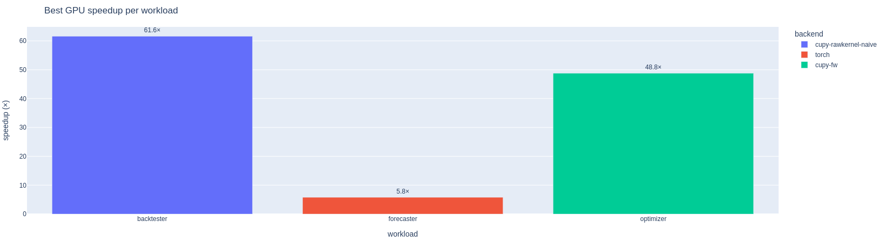
</p>
<p align="center"><em>Best validated GPU speedup per workload on an RTX 5060 — 61.6× (backtester kernel), 5.8× (forecaster baseline), 48.8× (optimizer QP). All 100% CPU-vs-GPU validated, read live from <code>results/</code>.</em></p>

<p align="center">
  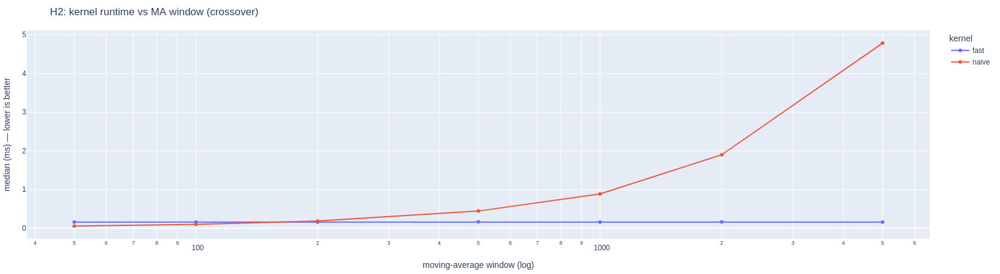
</p>
<p align="center"><em>H2, measured: the naive re-sum kernel scales <strong>O(window)</strong> (rising line) while the prefix-sum kernel stays <strong>flat O(1)-per-output</strong> — they cross at window ≥ 200. An O(1) algorithm isn't automatically faster; its fixed scan only pays off past the crossover.</em></p>

<p align="center">
  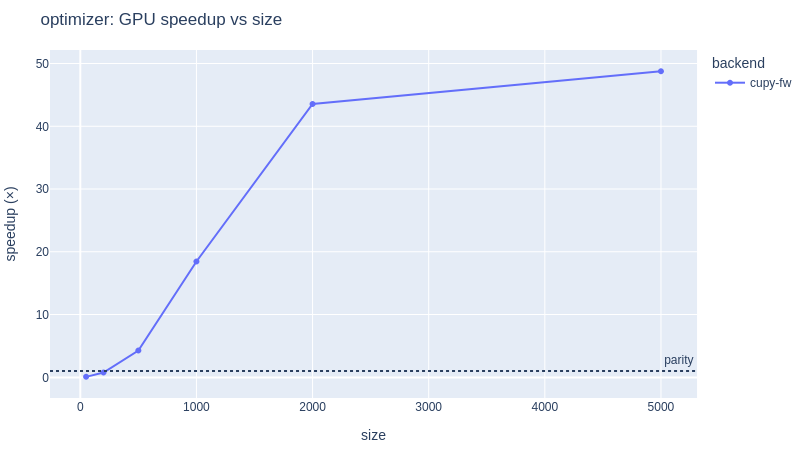
</p>
<p align="center"><em>H4, measured: the Markowitz QP's GPU speedup climbs through the parity line — CPU wins at small portfolios, GPU pulls ahead past ~200–500 assets and reaches 49× at 5000. The crossover is reported, not assumed.</em></p>

---

## Why CUDAlpha matters

Most GPU demos show *one* thing well — a speedup number, or a fancy kernel, or a dashboard — and treat the rest as scaffolding. That conflates two different questions: "is the GPU faster?" and "can you *show* it, defensibly, at every boundary, from a cold checkout?"

CUDAlpha separates those questions. The workloads are deliberately compact so a reader can hold the whole testbed in their head, and the surrounding infrastructure is deliberately complete so every claim is one `make` target away:

- **Reproducible** — pinned CPU deps, a fixed seed touched through `set_seed`, synthetic GBM data (no API keys, no network), and captured hardware/software metadata on every artifact. No "trust me, it was faster on my machine".
- **Statistically honest** — the runner discards warmup, then reports median / p95 / std over N steady-state trials, plus throughput, peak GPU memory, and sampled utilization. Single-shot timing is treated as a bug, not a result.
- **Validated** — every GPU path is checked against a CPU reference before its speedup is trusted, with mixed precision handled explicitly (fp16 compared at looser, documented tolerances rather than silently failing).
- **Profiled** — two genuine bottlenecks (forecaster host-stalls, backtester memory-bound kernel) are shown *before and after* a fix, with torch.profiler and Nsight recipes checked in.
- **Orchestrated** — the same runner that a laptop calls is what a Slurm `--array` task calls, one artifact per job, collected by an aggregator — the project's model for scaling any future workload.

---

## Background

CUDAlpha is a working case study of the standard GPU performance-engineering playbook, mapped onto real code. The table maps each idea to where it lives in this repo.

| Idea | How it maps into this repo | Reference |
|---|---|---|
| Benchmark like a scientist: warmup, steady state, distribution not point | [`cudalpha/benchmark.py`](cudalpha/benchmark.py) `time_callable` | [1] |
| Correctness before speed; mixed precision is a tolerance question | [`cudalpha/validate.py`](cudalpha/validate.py), `config.FP16_*` | [2] |
| Custom CUDA via runtime-compiled C (honest "custom kernel") | [`cudalpha/workloads/kernels.py`](cudalpha/workloads/kernels.py) CuPy `RawKernel` (NVRTC) | [3] |
| Memory-bound vs compute-bound: fix arithmetic intensity, re-profile | `rolling_mean_naive` → `rolling_mean_fast`; `ncu` recipe in [`profiling/`](profiling/) | [4] |
| Host-side stalls dominate small GPU work: pin, batch, overlap, graph-capture | [`cudalpha/workloads/forecaster.py`](cudalpha/workloads/forecaster.py) levers | [5] |
| Solver overhead means "GPU wins" is a *crossover*, not a constant | [`cudalpha/workloads/optimizer.py`](cudalpha/workloads/optimizer.py) scaling study | [6] |
| One result schema, one artifact per job, aggregate later | [`cudalpha/metrics.py`](cudalpha/metrics.py), [`bench/aggregate.py`](bench/aggregate.py) | [1] |
| HPC orchestration: job arrays, per-task artifacts, resource limits | [`slurm/sweep.sbatch`](slurm/sweep.sbatch), [`docker/docker-compose.yml`](docker/docker-compose.yml) | [7] |

Selected references:

1. NVIDIA, *Best Practices for Benchmarking CUDA Applications* — warmup, synchronization, and steady-state timing discipline.
2. IEEE 754 / mixed-precision training guidance — why fp16 output must be compared at documented tolerances, not against fp32 exactness.
3. [CuPy `RawKernel` documentation](https://docs.cupy.dev/en/stable/user_guide/kernel.html) — runtime NVRTC compilation of CUDA C from Python.
4. [NVIDIA Nsight Compute](https://developer.nvidia.com/nsight-compute) — the per-kernel memory-throughput / occupancy view used for bottleneck #2.
5. [NVIDIA Nsight Systems](https://developer.nvidia.com/nsight-systems) and [`torch.profiler`](https://pytorch.org/docs/stable/profiler.html) — the timeline / operator view used for bottleneck #1.
6. [NVIDIA cuOpt](https://developer.nvidia.com/cuopt) — the GPU QP (barrier) solver benchmarked against CVXPY.
7. [Slurm `sbatch --array`](https://slurm.schedmd.com/job_array.html) — the job-array orchestration model this sweep uses.

---

## The complete system

<p align="center">
  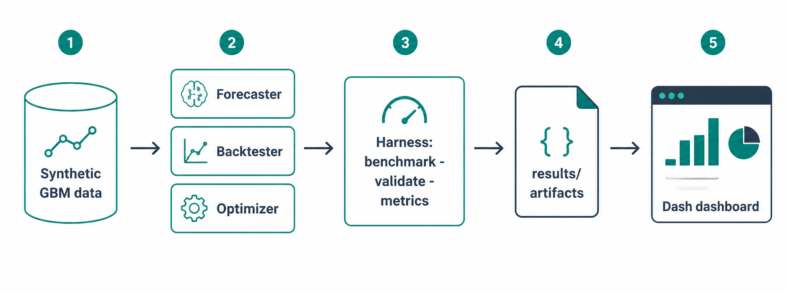
</p>
<p align="center"><em>The measured configuration: synthetic GBM data feeds three workloads, the harness benchmarks and validates them, each run lands as an artifact in <code>results/</code>, and the dashboard reads those artifacts back.</em></p>

### Harness contract

The harness is framework-agnostic: every workload exposes a prepared, zero-arg unit of work plus what's needed to time and validate it. The runner drives all three uniformly.

| Property | Current implementation |
|---|---|
| Timed unit | A zero-arg callable returning its output ([`Callable_`](cudalpha/workloads/base.py)) |
| Timing | Warmup discard, then N steady-state trials → median / p95 / std ([`benchmark.py`](cudalpha/benchmark.py)) |
| GPU sync | Per-workload `synchronize` (torch / cupy) so the clock waits for the device |
| Resource sampling | Peak GPU allocation (torch) + `nvidia-smi` utilization poller |
| Correctness | CPU output vs GPU output per size, fp16 handled explicitly ([`validate.py`](cudalpha/validate.py)) |
| Provenance | `run_id`, `job_id`, timestamp, git SHA, driver, GPU name, framework versions on every artifact |
| Result unit | One JSON file per (workload, device, backend, size) — one artifact per Slurm job |

### Workload surface

| Workload | CPU baseline | GPU path(s) | Sweep axis |
|---|---|---|---|
| Forecaster | PyTorch (`cpu`) LSTM+head inference | PyTorch (`cuda`) + AMP / `torch.compile` / CUDA graphs / pinned H2D | batch size |
| Backtester | NumPy cumsum SMA crossover | CuPy vectorized baseline; CuPy `RawKernel` (naive → prefix-sum fast) | series length |
| Optimizer | CVXPY (CLARABEL) Markowitz QP | CuPy Frank–Wolfe simplex solver (`cupy-fw`); cuOpt direct-QP path stubbed | number of assets |

**Optimizer GPU path — status:** the shipped GPU solver is a **CuPy Frank–Wolfe** conditional-gradient method over the probability simplex (`cupy-fw` in the scoreboard) — genuinely GPU-accelerated (the O(n²) `cov @ x` matvec runs on-device) and CPU-vs-GPU validated. The **cuOpt direct-QP path is stubbed** (`_cuopt_solve` raises `NotImplementedError`) and is a planned upgrade, not a claimed result. When wired, cuOpt would solve `min ½ xᵀQx + cᵀx` (barrier method, its only QP method) through its Python SDK — minding the ½ convention on `Q`. The crossover story (H4) holds regardless of which GPU solver runs.

### Results schema

Every run writes one [`BenchmarkResult`](cudalpha/metrics.py) as JSON:

```text
workload            forecaster | backtester | optimizer
device              cpu | gpu
backend             numpy | torch | cupy | cupy-rawkernel | cvxpy | cuopt
size                {"n_assets": 500} | {"batch": 512} | {"series_len": 1000000}
median_ms / p95_ms / std_ms       timing distribution over TRIALS
throughput          items/sec (workload-defined)
peak_mem_mb         GPU peak allocation
gpu_util_pct        sampled during the run
passed_validation   CPU-vs-GPU parity result (+ structured validation_detail)
speedup_vs_cpu      CPU median / GPU median
run_id / job_id / timestamp / env  provenance (git SHA, driver, GPU, versions)
```

---

## Data-to-evidence loop

<p align="center">
  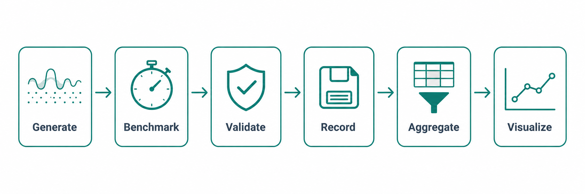
</p>
<p align="center"><em>The measurement loop: generate seeded data, benchmark to a distribution, validate CPU-vs-GPU, record one artifact per job, aggregate, and visualize.</em></p>

| Component | Path | Role |
|---|---|---|
| Data | [`cudalpha/data.py`](cudalpha/data.py) | Synthetic GBM prices, log returns, annualized mean/cov (no network, seeded) |
| Config | [`cudalpha/config.py`](cudalpha/config.py) | Seeds, sweep grids, tolerances, trial counts — the reproducibility surface |
| Workloads | [`cudalpha/workloads/`](cudalpha/workloads/) | CPU + GPU callables per workload behind a common interface |
| Benchmark | [`cudalpha/benchmark.py`](cudalpha/benchmark.py) | Warmup + trials timing, GPU mem/util sampling |
| Validation | [`cudalpha/validate.py`](cudalpha/validate.py) | CPU-vs-GPU parity, fp16-aware, portfolio feasibility |
| Metrics | [`cudalpha/metrics.py`](cudalpha/metrics.py) | Result schema + env capture + JSON IO |
| Sweep driver | [`bench/run_all.py`](bench/run_all.py) | One (workload, size, device) → one artifact; what a Slurm task calls |
| Aggregator | [`bench/aggregate.py`](bench/aggregate.py) | `results/*.json` → summary table + `summary.parquet` |
| Dashboard | [`dashboard/`](dashboard/) | Plotly Dash, six pages reading the same artifacts |

---

## Verification & evidence

Each layer establishes something specific — and, just as importantly, has stated limits.

| Layer | Representative targets | What it establishes | What it does *not* establish |
|---|---|---|---|
| Unit tests | `make test` (`tests/`) | Harness statistics, validation tolerances, schema IO, data + kernel reference math are correct — **runs CPU-only, no GPU required** | GPU kernel correctness on-device |
| CPU baselines | `make bench` (CPU paths) | Each workload's reference output and CPU timing distribution | GPU behavior |
| CPU-vs-GPU validation | per-run `validation_detail` | GPU output matches the CPU reference within tolerance before any speedup is trusted | Correctness beyond the swept sizes |
| Statistical benchmarking | `make bench` → `results/*.json` | Median / p95 / std, throughput, peak memory, sampled utilization per artifact | That the median generalizes off the benchmarked hardware |
| Profiling | [`profiling/`](profiling/) recipes → `traces/` | Root cause of two bottlenecks, before and after a fix (torch.profiler + Nsight) | Automatic regression detection |
| Orchestration | [`slurm/sweep.sbatch`](slurm/sweep.sbatch) → aggregated artifacts | The runner scales to a job array with per-task artifacts and resource limits | A production scheduler deployment |

### What the tests actually prove

The test suite (`tests/`, run by `make test`) is **CPU-only** by design: it verifies the harness's statistics, the validation tolerance logic (including the fp16 path), the results schema and its round-trip IO, the GBM data invariants, the aggregator, and a NumPy reference for the prefix-sum rolling mean the CUDA kernel implements. It does **not** execute CUDA — GPU kernel correctness is established at runtime by the CPU-vs-GPU `validation_detail` on a GPU host. This split is deliberate: the plumbing is provable anywhere; the device numbers require the device.

---

## Results (current snapshot)

Every number below is **produced by a `make` target and validated CPU-vs-GPU** (each row's run is `valid=True` or it is marked failed). The scoreboard is what `make aggregate` prints from `results/*.json`.

> **The evidence is checked in.** These are not aspirational numbers: the raw per-run artifacts from this RTX 5060 run are committed under [`results/sample/`](results/sample/) (46 JSONs + `summary.parquet` + `SCOREBOARD.md`), the two `torch.profiler` traces under [`traces/sample/`](traces/sample/), and the measured before/after tables in [`profiling/RESULTS.md`](profiling/RESULTS.md). Live runs write to the git-ignored `results/`; `results/sample/` is the tracked snapshot.

> **Measured on:** NVIDIA GeForce RTX 5060 Laptop GPU (Blackwell, 8 GB), driver 580.159.03 / CUDA 13.0; PyTorch (cu128), CuPy (CUDA 12.x), CVXPY 1.5 / CLARABEL; Python 3.11. Timings are steady-state medians over 30 trials after warmup. Your absolute numbers will differ by GPU; the *shape* of each result (the crossovers) is the point.

### Benchmark scoreboard

Headline rows across the three workloads — including where the GPU **loses**, which is kept on purpose:

| Workload | Size | CPU (ms) | GPU (ms) | Speedup | GPU util | Backend | Reproduce |
|---|---:|---:|---:|---:|---:|---|---|
| Forecaster (fp32 baseline) | batch=2048 | 146.7 | 27.3 | **5.4×** | 37% | `torch` | `make bench-forecaster` |
| Forecaster (opt. stack) | batch=512 | 7.38 | 0.93 | **8.0×** | — | pinned+AMP+compile+CUDA-graph | `make profile-forecaster` |
| Backtester (SMA-crossover) | series_len=1e6 | 10.55 | 0.17 | **61.6×** | — | `cupy-rawkernel-naive` (w=50) | `make bench-backtester` |
| Optimizer (Markowitz QP) | n_assets=50 | 2.84 | 33.2 | **0.09×** | — | `cupy-fw` — *CPU wins* | `make bench-optimizer` |
| Optimizer (Markowitz QP) | n_assets=5000 | 15068 | 308.9 | **48.8×** | 92% | `cupy-fw` (barrier fallback) | `make bench-optimizer` |

The optimizer row pair is the whole point of H4: barrier/solver overhead makes the **CPU win at 50 assets and the GPU win 49× at 5000** — a measured crossover between 200 and 500 assets, not an assumed victory.

<details>
<summary><strong>Per-workload charts</strong> (from the dashboard, exported live)</summary>

**Backtester** — runtime, speedup, and throughput across series length (naive kernel leads at the default window=50):

<p align="center">
  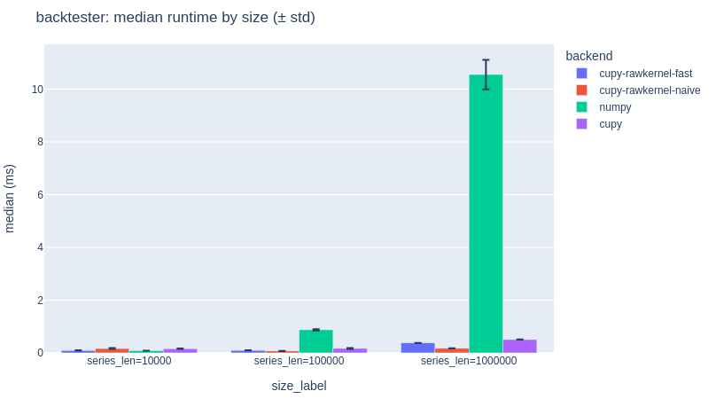
  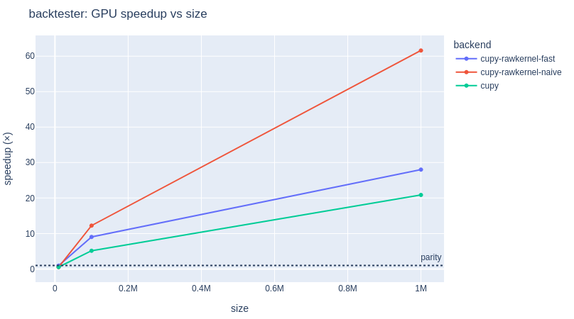
  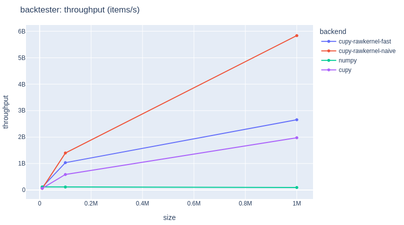
</p>

**Forecaster** — runtime, speedup, throughput, and peak GPU memory across batch size (memory scales with batch; util rises with it):

<p align="center">
  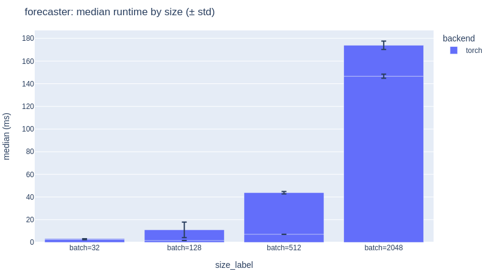
  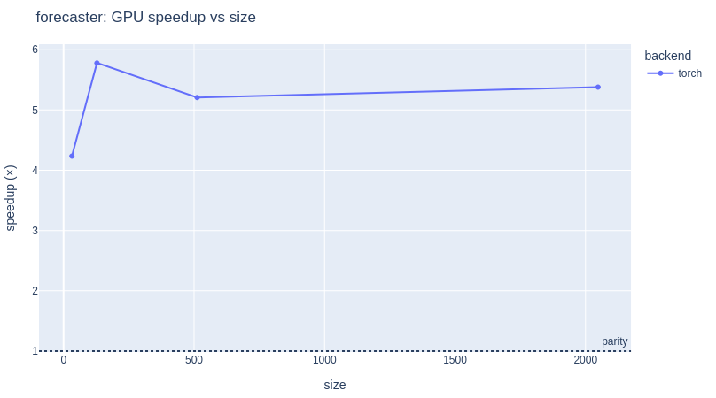
  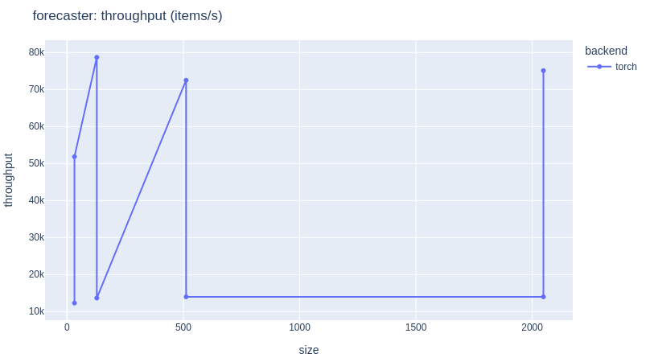
  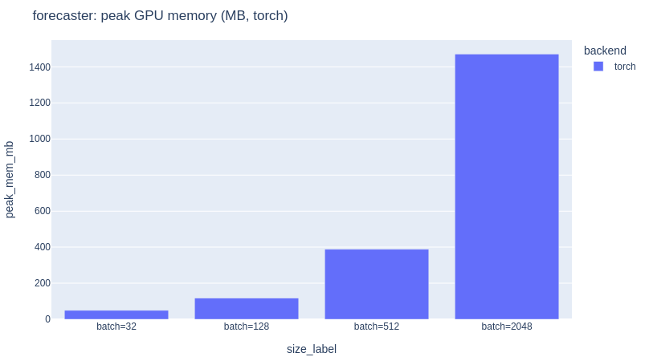
</p>

**Optimizer** — runtime, speedup, and throughput across portfolio size (CPU's 15 s at 5000 assets vs the GPU's flat ~50 ms):

<p align="center">
  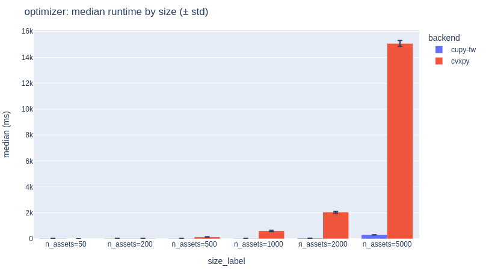
  
  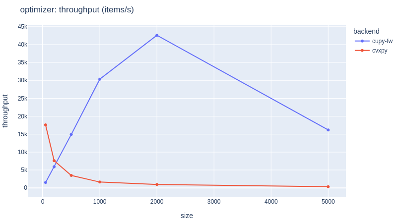
</p>

</details>

### H2: the rolling-mean kernel crossover (`make bench-kernel-sweep`)

Sweeping the moving-average window at a fixed 1e6-element series shows the naive kernel scaling **O(window)** while the prefix-sum kernel stays **flat O(1)-per-output** — they cross at window ≥ 200:

| MA window | naive (ms) | prefix-sum (ms) | winner |
|---:|---:|---:|---|
| 50 | 0.06 | 0.16 | naive |
| 100 | 0.10 | 0.16 | naive |
| 200 | 0.18 | 0.16 | **prefix-sum** |
| 500 | 0.44 | 0.16 | prefix-sum |
| 1000 | 0.89 | 0.16 | prefix-sum |
| 2000 | 1.90 | 0.16 | prefix-sum |
| 5000 | 4.78 | 0.16 | **prefix-sum (~30×)** |

The lesson H2 actually teaches: an O(1) algorithm isn't automatically faster — its fixed scan overhead only pays off once the window is large enough. That's a *when*, and the sweep measures it.

### Bottleneck #1: forecaster optimization arc (`make profile-forecaster`, batch 512)

`torch.profiler` shows the baseline spending **92% of CPU time in `aten::copy_`** (the H2D transfer) and only ~3% in `aten::_cudnn_rnn` — the model is host-bound, not compute-bound. Removing that stall:

| Stage | median (ms) | GPU util | Read |
|---|---:|---:|---|
| baseline (pageable H2D) | 7.38 | 28% | copy-bound (92% of time in `copy_`) |
| + pinned / non-blocking | 7.31 | 28% | barely moves — the copy *is* the work |
| + AMP (fp16) | 1.47 | 44% | **the big win (5×)** — half the bytes |
| + `torch.compile` | 1.31 | — | small extra |
| + CUDA graph | **0.93** | — | **8.0× total** — removes launch overhead |

The honest nuance — pinning alone barely helped; AMP and CUDA graphs did the work — is itself the finding: it comes from reading the profile, not the expectation.

---

## AI usage and division of work

This project uses AI assistance and documents it rather than hiding it. The division of work:

- **AI-assisted:** harness and workload scaffolding against a human-specified contract, first-pass documentation, dashboard page layouts, and this README.
- **Human-owned:** the workload selection and depth roles, the benchmarking methodology (warmup / distribution / validation), the kernel optimization strategy, profiling interpretation, and all merge decisions.
- **The canonical gate is never the assistant:** every accepted change must pass `make test`, and every performance/utilization claim must come from a saved artifact or a profiler trace. AI output is treated as a draft to be verified, not as evidence.

---

## Repository map

```text
cudalpha/                harness + workloads (the product)
├── config.py            seeds, sweep grids, tolerances, trial counts
├── data.py              synthetic GBM prices, returns, mean/cov
├── benchmark.py         warmup + trials timing, GPU mem/util sampling
├── validate.py          CPU-vs-GPU parity (incl. fp16 handling), feasibility
├── metrics.py           results schema + env capture + JSON IO
└── workloads/
    ├── base.py          the Workload / Callable_ contract + gpu_available()
    ├── forecaster.py    PyTorch inference + optimization levers (bottleneck #1)
    ├── backtester.py    NumPy / CuPy / RawKernel SMA-crossover paths
    ├── kernels.py       custom CUDA C RawKernels (naive + prefix-sum fast)
    └── optimizer.py     CVXPY vs CuPy Frank–Wolfe QP study (cuOpt path stubbed)
bench/                   run_all.py (sweep driver) + aggregate.py
tests/                   CPU-only pytest suite (harness, validation, schema, math)
slurm/                   sweep.sbatch (job array) + setup notes
docker/                  Dockerfile + compose (benchmark / dashboard profiles)
dashboard/               Dash app + 6 pages (Overview … Validation)
profiling/               Nsight / torch.profiler capture recipes
results/                 one JSON artifact per job (+ summary.parquet)
traces/                  Nsight / profiler captures
docs/                    WINDOWS.md (WSL2 note)
```

---

## Known limitations

Stated plainly:

- **GPU numbers require a GPU host.** The test suite and CPU baselines run anywhere; the speedups, utilization, peak-memory figures, and Nsight traces are produced on a CUDA machine. This checkout does not embed GPU results — it embeds the commands that produce them.
- **The finance is intentionally simplified.** This is not a trading system; the workloads are realistic GPU *loads to measure*, not models meant to make money. Synthetic GBM data stands in for market data so the pipeline stays seeded and network-free.
- **GPU libraries are not pinned.** `cupy` and `nvidia-cuopt` are environment-specific (CUDA major version, compute capability) and are installed to match your host, so their exact versions are not fixed in `requirements.txt`.
- **cuOpt QP path may need a fallback.** cuOpt's QP interface and availability vary by version/GPU; the optimizer documents a CuPy interior-point fallback and adjusts its claim accordingly if cuOpt QP is unavailable.
- **Utilization sampling is coarse.** `nvidia-smi` polling gives the before/after utilization story; the fine-grained view is Nsight, captured separately.
- **Slurm is simulated locally.** The sweep is designed for a job array; running it against a local `slurm-docker-cluster` demonstrates the workflow but is not a real HPC deployment unless submitted on one.
- **Windows is WSL2-only.** Native Windows is not a target (CUDA tooling, containers, and Slurm assume Linux); see [`docs/WINDOWS.md`](docs/WINDOWS.md).

---

## Appendix: setup and reproduction

Every headline claim above maps to one of these commands.

### 1. Set up

```bash
make setup                       # pip install -r requirements.txt (CPU-side deps)
# then install the GPU libraries matching YOUR CUDA version:
#   pip install cupy-cuda12x nvidia-cuopt
```

GPU libraries (`cupy`, `nvidia-cuopt`) are environment-specific and intentionally not pinned — install the builds matching your CUDA version (see [`requirements.txt`](requirements.txt)).

### 2. Reproduce the verification evidence (no GPU required)

```bash
make test                        # CPU-only pytest suite: harness, validation, schema, math
```

### 3. Reproduce the benchmark evidence (requires a CUDA GPU)

```bash
make bench                       # all workloads CPU+GPU → results/*.json
make bench-forecaster            # just the forecaster sweep
make bench-backtester            # just the backtester sweep (incl. RawKernel path)
make bench-kernel-sweep          # H2 study: naive-vs-prefix-sum kernel across MA windows
make bench-optimizer             # just the optimizer scaling study
make aggregate                   # results/ → summary table + results/summary.parquet
```

### 4. Reproduce the profiling evidence (requires Nsight)

```bash
# bottleneck #1: forecaster host-stalls (timeline + operator view)
nsys profile -o traces/forecaster_baseline python -m bench.run_all --workload forecaster --sizes 512
# bottleneck #2: rolling-mean kernel (per-kernel deep dive)
ncu -o traces/rolling_mean_naive python -m bench.run_all --workload backtester --sizes 1000000
```

See [`profiling/README.md`](profiling/README.md) for the full before/after recipe.

### 5. Serve the dashboard

```bash
make dashboard                   # http://localhost:8050
```

### 6. Containerized (requires NVIDIA Container Toolkit)

```bash
make docker-build
make docker-bench                # runs the sweep on the GPU in a container
make docker-dashboard            # serves the dashboard from a container
```

### 7. HPC-style orchestration (requires Slurm)

```bash
sbatch slurm/sweep.sbatch        # one array task per size, one artifact per task
make aggregate                   # collect the array's artifacts
```

---

## Positioning

This is **not** a trading system, and the finance is simplified on purpose — the demonstrated skill is making GPU workloads fast and *proving it with data*: containerized, Slurm-orchestrated, statistically benchmarked, CPU-vs-GPU validated, Nsight/PyTorch profiled, with a genuine custom CUDA kernel and a GPU QP scaling study (CuPy Frank–Wolfe; cuOpt path stubbed), visualized in a Python-first Dash dashboard.

## License

See [LICENSE](LICENSE).
